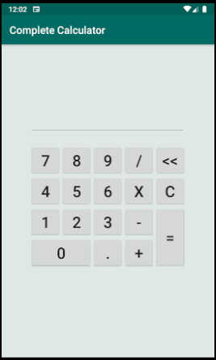

# MyAndroidCalculator
### Idioma do README (pt / [en](README.md))

Primeiro projeto prático da disciplina INF-311 (Programação Para Dispositivos Móveis), na Universidade Federal de Viçosa (UFV) 

### O programa possui 3 activities:
* **Princial:** Menu de navegação entre as outras 2 activities.
* **Calculadora Simples:** Com 2 inputs de texto, 4 botões para o calculo e um texto de resposta.
* **Calculadora Completa:** Um visor e diversos botões simulando um "numpad" de computador.

**OBS:** A calculadora completa ao tratar mais de uma sentença, no momento em que é adicionado um segundo operador matemático, é mostrada a resposta + esse novo operador na tela  (similar ao comportamento de uma calculadora comum).

### Screenshots
<table>
  <tr>
    <td></td>
    <td></td>
    <td></td>
  </tr>
 </table>
