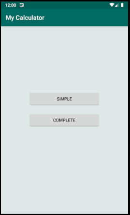
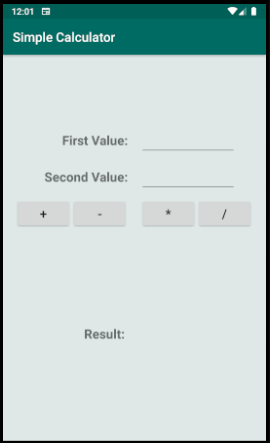
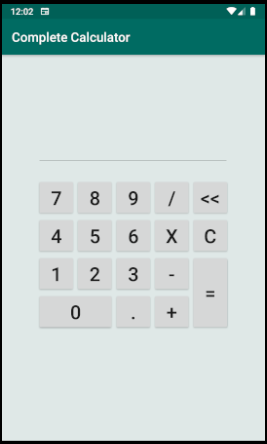

# MyAndroidCalculator
### README language ([pt](README-pt.md) / en)

First practical project of the discipline INF-311 (Programming for Mobile Devices), at the Federal University of Viçosa (UFV)

### The program has 3 activities:
* **Main:** Navigation menu between the other 2 activities.
* **Simple Calculator:** With 2 text inputs, 4 buttons for calculation and an answer text.
* **Complete Calculator**: A display and several buttons simulating a computer "numpad".

**NOTE:** The complete calculator when handling more than one sentence, at the moment when a second mathematical operator is added, the answer + this new operator is shown on the screen (similar to the behavior of a common calculator).

### Screenshots
<table>
  <tr>
    <td></td>
    <td></td>
    <td></td>
  </tr>
 </table>
